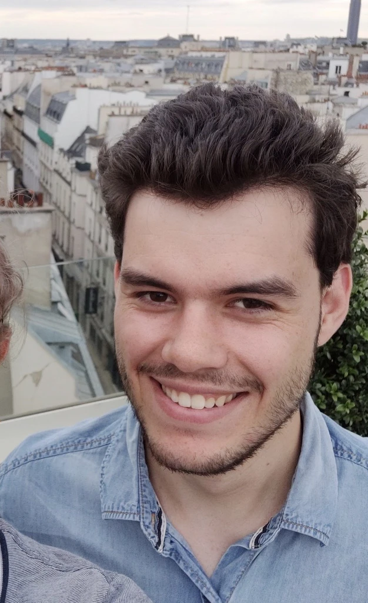
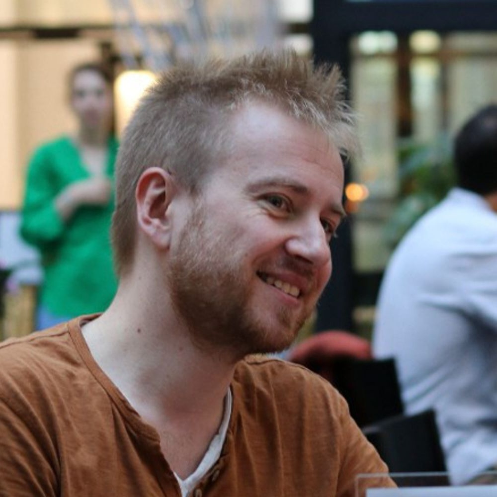
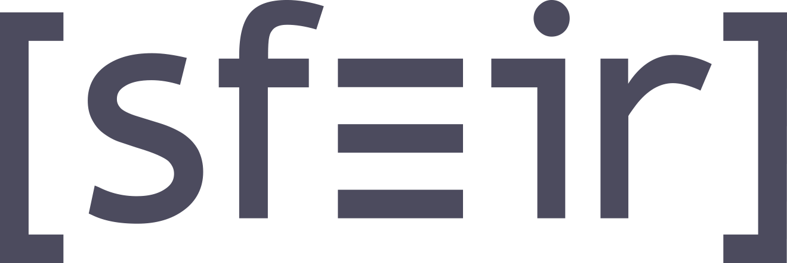
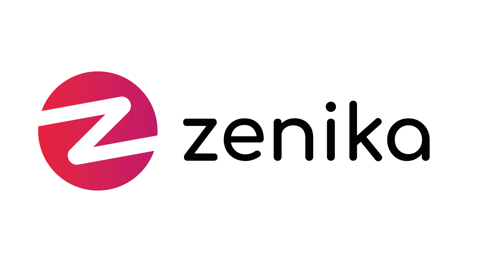

# 🧠 Meetup GenAI Nantes

## Events

- [2023-06-13 - Hello world](./S1E01%20-%20Hello%20world/)
- [2023-07-20 - Workshop: Build your first AI Agent (Code & No-Code)](./S1E02%20-%20Workshop%20langchain/)
- [2023-10-23 - Fine-tuner des modèles open source pour faire mieux que GPT4](./S2E1%20-%20Crisp/)
- [2023-11-28 - Améliorer la productivité des développeurs avec Github Copilot](./S2E02%20-%20Github%20Copilot/)
- [2023-12-19 - Le RAG: booster de connaissances pour la GenAI ?](./S2E03%20-%20Devana/)
- [2024-01-23 - REX sur la création d’Auto PHP, un agent autonome open source](./S2E04%20-%20Theodo/)
- [2024-02-15 - Utilisation d'un LLM en Java, Gemini et LangChain4J](./S2E05%20-%20Google%20Cloud%20Platform/)
- [2024-03-13 - Les LLMs dans le parcours conversationnel du e-commerce](./S2E06%20-%20iAdvize/)
- [2024-03-27 - Hugging Face: L'IA générative open-source](./S2E07%20-%20Hugging%20Face/)
- [2024-04-04 - Nuit des meetups: Intro à la GenAI](./S2E08%20-%20Nuit%20des%20meetups/)
- [2024-04-17 - Fine-tuning d'un modèle de génération d’image](./S2E09%20-%20Seelab/)
- [2024-05-22 - Before hackathon Shift: use cases](./S2E10%20-%20Hors%20Série%20-%20Before%20Shift/)
- [2024-06-19 - AWS - Développement d'applications web d'IA générative](./S2E11%20-%20AWS/)
- [2024-07-11 - Code ton premier agent conversationnel](./S2E12%20-%20Workshop%20Streamlit%20+%20Langchain/)
- [2024-09-18 - Les dessous de Llama 3](./S3E01%20-%20Meta/)
- [2024-10-09 - Evaluation des RAG: Le Bon, la Brute et le Troublant](./S3E02%20-%20LeBonCoin/)
- [2024-11-05 - Better, faster, stronger prototypes](./S3E03%20-%20Prototypes/)
- [2024-12-19 - Lost in transcription](./S3E04%20-%20Gladia/)
- [2025-01-22 - Créer une startup GenAI en solopreneur en 2024](./S3E05%20-%20Globetrotters/)
- [2025-02-26 - Doctolib: Building an Agentic AI System for Healthcare Support](./S3E06%20-%20Doctolib/)
- [2025-03-19 - Before hackathon Shift: use cases santé, éducation et culture](./S3E07%20-%20Hors%20Série%20-%20Before%20Shift/)
- [2025-04-16 - Lucie, from scratch with love](./S3E08%20-%20Lucie/)
- [2025-05-14 - Meilisearch - Vector databases & MCP servers](./S3E09%20-%20Meilisearch/)
- [2025-05-22 - Nuit des meetups: Intro à la GenAI](./S3E10%20-%20Nuit%20des%20meetups/)

### Suivre les prochains évènements

- [Meetup.com](https://www.meetup.com/generative-ai-nantes)
- [Eventbrite](https://www.eventbrite.com/o/generative-ai-nantes-73163402733)

## RFP

Proposez vos talk sur le lien suivant: https://survey.screeb.app/1/1152a2d6-7afe-4938-a805-cbfa9bf1b3e6/d174c71d-76f6-4061-93cb-c556cba17c35

## Organisateurs

|                                              Maxime Pitussi                                              |                                               Samuel Berthe                                               |                                                        Simon Timsalle                                                        |
| :------------------------------------------------------------------------------------------------------: | :-------------------------------------------------------------------------------------------------------: | :--------------------------------------------------------------------------------------------------------------------------: |
|  |  |  |

## Partenaires

Merci à nos partenaires ❤️

